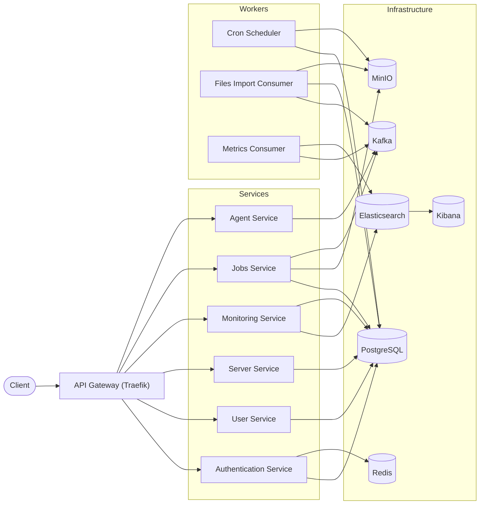
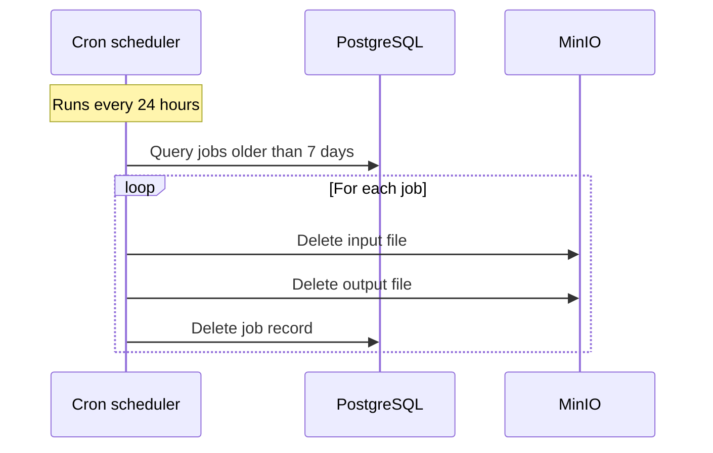

# SMS-X System Design Document

---

# 1. System Overview

SMS-X is a backend system designed to manage and monitor the operational status of up to 10,000 servers.

Instead of manually checking server health, users interact with SMS-X via APIs to:
- Register and manage servers
- Monitor server health status
- Query server information
- Generate uptime reports
- Receive automated email notifications (Or can send manually)

The system follows a **service-oriented architecture (SOA-style)** with clear service boundaries, designed to evolve toward full microservices, separating concerns into multiple services as independent, deployable applications.

---

# 2. Goals & Requirements

## 2.1 Functional Requirements

- Manage servers (CRUD operations)
- Store and query server status
- Support filtering, pagination, and sorting
- Import/export server data via CSV
- Generate reports:
  - Total servers
  - Servers up/down
  - Uptime percentage
- Send daily email reports
- Provide authentication and authorization

## 2.2 Non-Functional Requirements

- Handle up to 10,000 servers
- Ensure secure authentication using JWT
- Use appropriate storage technologies:
  - PostgreSQL
  - Elasticsearch
  - Redis
- Provide OpenAPI documentation
- Maintain modular and scalable architecture

---

# 3. High-Level Architecture



## Monitoring Models

The system supports the main monitoring approach of the **push model**, by letting each monitored server runs an agent that continuously pushes metrics to the system via API → Kafka → consumers → Elasticsearch.

This approach is used, as it scales better, avoids network/firewall issues, and enables richer telemetry (CPU, memory, I/O) when compared to others like the pull model (i.e. pinging all servers at intervals)

## System components

The system consists of the following components:

1. API Gateway: Handling all clients requests

   - Route user requests, acting as a reverse proxy and load balancer
   - Requests are forwarded to the appropriate services

2. Server service: Deals with the management of all servers, including:

   - CRUD operations
   - Search for servers with pagination
   - File exporting (For now, will be moved to Jobs Service after, as it is a long-running task)

3. User service: Deals with the management of all user, including CRUD operations, and search by email

4. Auth service: Deals with operations relating to authentication/authorization, including login/logout, and refresh JWT tokens

5. Jobs service: Manage all long-running tasks. Currently used for file uploading workflow, but in the future, it will be used to manage more workflows

6. Monitoring service: Centralize the data aggregation of server's statuses. Right now it's just used for push and pull model of servers with metrics only, but in the future, it would be expanded for more things like collecting logs and traces

7. Agent service: Manage all registered services and their operations, by allowing the registration of agents, and metrics ingestions from agents

8. Cron scheduler: A worker to be ran periodically (Daily for now), dealing with tasks of sending emails, cleaning up DBs, etc.

9. Kafka consumer workers: Kafka consumers to consume messages from async workflows, and keep processing and commit messages manually

10. Files import consumer: Kafka consumer to consume CSV files import jobs. **RabbitMQ is currently considered** as future alternative instead

---

# 4. API Workflows

## 4.1 Auth

- `POST /auth/login`: Help user log in
   ```mermaid
   sequenceDiagram

    actor Client
    participant Gateway as API Gateway
    participant AuthSvc as Auth Service
    participant UserSvc as User Service
    participant DB as PostgreSQL
    participant Redis

    %% =========================
    %% LOGIN WORKFLOW
    %% =========================

    Client->>Gateway: POST /auth/login (email, password)
    Gateway->>AuthSvc: Forward request

    AuthSvc->>AuthSvc: Validate request

    alt Invalid request body
        AuthSvc-->>Gateway: 400 Bad Request
        Gateway-->>Client: Error
    else Valid request

        %% =========================
        %% USER VALIDATION
        %% =========================
        AuthSvc->>UserSvc: GET /user (Using email)

        Note right of UserSvc: Query user from database

        UserSvc-->>AuthSvc: User data

        AuthSvc->>AuthSvc: Verify password (bcrypt)

        alt Invalid credentials
            AuthSvc-->>Gateway: 401 Unauthorized
            Gateway-->>Client: Error
        else Valid credentials

            %% =========================
            %% TOKEN GENERATION
            %% =========================
            AuthSvc->>AuthSvc: Generate Access Token (15m)

            Note right of AuthSvc: JWT (HS256)<br>user_id, role, exp, iat

            AuthSvc->>AuthSvc: Generate Refresh Token (7d)

            %% =========================
            %% STORE REFRESH TOKEN
            %% =========================
            AuthSvc->>Redis: SET refresh:<token> (TTL 7d)

            Note right of Redis: value = user info<br>Used for session validation

            Redis-->>AuthSvc: OK

            %% =========================
            %% RESPONSE
            %% =========================
            AuthSvc-->>Gateway: access + refresh tokens
            Gateway-->>Client: 200 OK
        end
    end
   ```

- `POST /refresh`: Help user refresh their access token, using their refresh token, to help users in case of losing access token, or access token expired
   ```mermaid
   sequenceDiagram

    actor Client
    participant Gateway as API Gateway
    participant AuthSvc as Auth Service
    participant Redis

    %% =========================
    %% REFRESH WORKFLOW
    %% =========================

    Client->>Gateway: POST /refresh (refreshToken)
    Gateway->>AuthSvc: Forward request

    AuthSvc->>AuthSvc: Validate request

    alt Missing or invalid body
        AuthSvc-->>Gateway: 400 Bad Request
        Gateway-->>Client: Error
    else Valid request

        %% =========================
        %% VALIDATE REFRESH TOKEN
        %% =========================
        AuthSvc->>Redis: GET refresh:<token>

        alt Token not found or expired
            Redis-->>AuthSvc: nil
            AuthSvc-->>Gateway: 401 Unauthorized
            Gateway-->>Client: Error
        else Token valid
            Redis-->>AuthSvc: user data

            %% =========================
            %% TOKEN ROTATION
            %% =========================
            AuthSvc->>Redis: DEL refresh:<token>

            Note right of AuthSvc: Refresh token rotation\nPrevents replay attacks

            %% =========================
            %% ISSUE NEW TOKENS
            %% =========================
            AuthSvc->>AuthSvc: Generate Access Token (15m)
            AuthSvc->>AuthSvc: Generate Refresh Token (7d)

            AuthSvc->>Redis: SET refresh:<new_token> (TTL 7d)

            %% =========================
            %% RESPONSE
            %% =========================
            AuthSvc-->>Gateway: new access + refresh tokens
            Gateway-->>Client: 200 OK
        end
    end
   ```

Note: 

- JWT tokens in this application are signed using HS256 algorithm (i.e symmetric signing. The secret is stored securely in server by only provided from .env, not hardcoded). The registered claims contains information on expiration time, and when it is issued, and for private claims, user ID, role (admin/user), and token type (refresh/access) are stored
- For the future, asymmetric signing will be considered and researched into 

## 4.2 Servers

- `GET /servers`: Retrieve servers information
   - Extract search query parameters from the URL. The parameters are for searching (by status, by server's protocol, and/or by server's name), pagination (Currently still using offset pagination), and sorting (by which field, which order) -> 400 if the parameters are fed with invalid value (E.g. offset with string and not number)
   - If some criterias above are not provided, there will be default values for it
   - Get the servers based on search, pagination, and ordering criteria, then returns back to the user

- `GET /servers/:id`: Retrieve a server's information
   - Check if the id in the path parameter is a valid number -> Returns 400 if id is negative number, or not a number
   - Try retrieve that server in Postgres -> Returns 404 if not exist, otherwise, return the server info back to user in the response

- `POST /servers`: Create a server
   - User send the request with body content for server creation. The system checks if all necessary info (name, status, IP address, port, protocol) are provided, if not provided or invalid data -> Returns 400
   - The system try to create a record of this server. If the server already exist or some other error happens -> Returns 500, alongside with reason message (E.g.: Server already existed)
   - After creating the server successfully, the server service will create a record of a registered agent's info in DB (which includes the associated server ID, and the API key, hashed already using SHA256 checksum, of course), then return the plain API key back in the response. Of course, like all other API keys, it only appears once in the response for security purpose

      ```mermaid
      sequenceDiagram

      actor User
      participant Gateway as API Gateway
      participant ServerSvc as Server Service
      participant AgentSvc as Agent Service
      participant DB as PostgreSQL

      Note over User,Gateway: Create new server

      User->>Gateway: POST /servers
      Gateway->>ServerSvc: Forward request

      ServerSvc->>ServerSvc: Validate request

      alt Invalid request
         ServerSvc-->>Gateway: 400 Bad Request
         Gateway-->>User: Error response
      else Valid request

         %% Create server
         ServerSvc->>DB: Insert server record
         DB-->>ServerSvc: server_id

         %% Generate API key
         ServerSvc->>ServerSvc: Generate API Key (plain)

         %% Delegate to Agent Service
         ServerSvc->>AgentSvc: RegisterAgent(server_id, api_key)

         AgentSvc->>AgentSvc: Hash API key (SHA256)

         AgentSvc->>DB: Store agent record\n(server_id, hashed_key)

         DB-->>AgentSvc: OK
         AgentSvc-->>ServerSvc: OK

         %% Response
         ServerSvc-->>Gateway: 201 Created (server + API key)
         Gateway-->>User: Response (API key shown once)

      end

      Note over AgentSvc,DB: API key is stored hashed\nPlain key is never persisted

      Note over User: User configures agent\nwith API key on their server
      ```

- `DELETE /servers/:id`: Delete a server
   - Check if given id is valid -> Returns 400 if invalid or negative number
   - Check if user exist in Postgres -> Returns 404 if not exist
   - Delete the record in Postgres, then returns 204

- `PATCH /servers/:id`: Edit a server
   - Check if given id or request body is valid -> Returns 400 if either is invalid
   - Check if the server with given ID exist -> 404 if not
   - Update the fields in the record in Postgres, then returns 200 with the newly updated record in the response's body

- `GET /servers/export`:

   ```mermaid
   sequenceDiagram

   actor Client
   participant Middleware as Auth Middleware
   participant Handler as Gin Handler
   participant Service as Server Service
   participant Repo as Server Repository
   participant DB as PostgreSQL

   Client->>Middleware: GET /servers/export (JWT, query)

   alt Invalid JWT / Not admin
      Middleware-->>Client: 401 Unauthorized
   else Authenticated
      Middleware->>Handler: Forward request

      Handler->>Handler: ParseServersQuery()

      alt Invalid query params
         Handler-->>Client: 400 Bad Request
      else Valid query

         Handler->>Service: GetServers(query)
         Service->>Repo: FindAll(query)

         Repo->>Repo: Build SQL query (filters, sort, pagination)

         Note right of Repo: Filters: status, protocol, name (ILIKE)<br>Safe sort whitelist<br>Prevent SQL injection<br>Count before pagination<br>Offset pagination (performance tradeoff)

         Repo->>DB: SELECT + COUNT
         DB-->>Repo: rows + total
         Repo-->>Service: servers, total
         Service-->>Handler: PaginatedServers

         Handler->>Handler: Set headers (text/csv)

         %% ✅ FIXED NOTE (removed problematic symbols)
         Note right of Handler: Content-Disposition<br>attachment filename servers.csv

         Handler->>Handler: Write CSV header

         loop For each server
               Handler->>Handler: Write CSV row
         end

         Handler->>Handler: Flush writer

         alt CSV write error
               Handler-->>Client: 500 Internal Server Error
         else Success
               Handler-->>Client: 200 OK (CSV stream)
         end
      end
   end

   Note over Handler: Large exports are memory-bound<br>Future: stream from DB or async export job
   ```

## 4.3 Jobs

- `POST /jobs/import-server`: Import servers from a csv file
   - Create a job:
      ```mermaid
      sequenceDiagram

      actor User
      participant API as Jobs Service
      participant DB as PostgreSQL
      participant MinIO
      participant Kafka

      Note over User,API: POST /jobs/import-server

      User->>API: Upload CSV file

      API->>API: Generate Job ID (UUID)

      API->>MinIO: Upload file\njobs/<job-id>/input.csv

      API->>DB: Insert job record (status = pending)

      API->>Kafka: Publish job message

      API-->>User: Return job_id
      ```
   - Processing (In consumer worker):
      ```mermaid
         sequenceDiagram

         participant Kafka
         participant Worker as Files import consumer
         participant DB as PostgreSQL
         participant MinIO

         Note over Kafka,Worker: Async job processing

         Worker->>Kafka: Consume message

         alt Invalid message (poison)
            Worker->>Worker: Skip message
         else Valid message

            Worker->>DB: Check job status

            alt Job already done
                  Worker->>Kafka: Commit message
            else Not processed

                  Worker->>DB: Update status = processing

                  Worker->>MinIO: Download input file

                  loop Process CSV rows
                     Worker->>Worker: Parse row

                     alt Invalid row
                        Worker->>Worker: Record failure
                     else Valid row
                        Worker->>Worker: Add to batch

                        alt Batch full OR EOF
                              Worker->>DB: Batch upsert

                              alt Batch error
                                 Worker->>Worker: Fallback to single insert
                                 Worker->>DB: Insert one-by-one
                              end
                        end
                     end
                  end

                  Worker->>DB: Update job result (success/failed counts)

                  Worker->>MinIO: Upload failed rows JSON\njobs/<job-id>/output.json

                  Worker->>DB: Update status = done

                  Worker->>Kafka: Commit message
            end
         end

         Note over Worker,DB: Idempotency via job status check

         Note over Worker: Batch processing improves performance\nFallback ensures correctness
      ```

- `GET /jobs/:id`: Get a job's status

   ```mermaid
   sequenceDiagram

    actor User
    participant API as Jobs Service
    participant DB as PostgreSQL
    participant MinIO

    Note over User,API: GET /jobs/:id

    User->>API: Request job status

    API->>DB: Fetch job

    alt Job not found
        API-->>User: Not found
    else Found

        API->>MinIO: Generate presigned URL (input file)

        API->>MinIO: Generate presigned URL (output file)

        alt Output not ready
            API->>API: Omit output URL
        end

        API-->>User: Job status + URLs
    end

    Note over API,MinIO: Uses public endpoint for presigned URLs\nPrivate endpoint for internal ops
   ```

Later clean up in cron scheduler:



## 4.4 Agents

- `POST /agent/metrics`: API for registered agents to push metrics

   1. Agent calls API POST /agent/metrics: Push metric message to Kafka 
   
   2. Metrics consumer: Consumer keep fetching messages, until it either reaches the limit of a batch size (So that, batch insert to Elasticsearch will be possible and reduce latency by saving API calls to ES), or after X seconds, it will be flushed anyway. The process of consuming message is simple: It will try pushing to Elasticsearch for an amount of times, and if after some N retries it still fails to push to Elasticsearch, the message will be pushed to a DLQ

   ```mermaid
   sequenceDiagram

    actor Agent
    participant Gateway as API Gateway
    participant AgentSvc as Agent Service
    participant Kafka
    participant Consumer as Metrics Consumer
    participant ES as Elasticsearch
    participant DLQ as Kafka DLQ

    %% =========================
    %% INGESTION API
    %% =========================
    Note over Agent,Gateway: POST /agent/metrics

    Agent->>Gateway: Send metrics (API key)
    Gateway->>AgentSvc: Forward request

    AgentSvc->>AgentSvc: Validate API key

    alt Invalid API key
        AgentSvc-->>Gateway: 401 Unauthorized
        Gateway-->>Agent: Reject request
    else Valid API key

        AgentSvc->>Kafka: Publish metric event
        AgentSvc-->>Gateway: 202 Accepted
        Gateway-->>Agent: Accepted
    end

    %% =========================
    %% CONSUMER PROCESSING
    %% =========================
    Note over Consumer,Kafka: Async batch processing

    Consumer->>Kafka: Poll messages

    loop Until batch full OR timeout
        Consumer->>Consumer: Accumulate messages
    end

    Consumer->>ES: Bulk insert metrics

    alt Success
        ES-->>Consumer: OK
        Consumer->>Kafka: Commit offsets
    else Failure

        loop Retry N times
            Consumer->>ES: Retry bulk insert
        end

        alt Still failing
            Consumer->>DLQ: Publish failed batch
            Consumer->>Kafka: Commit offsets
        end
    end

    %% =========================
    %% NOTES
    %% =========================
    Note over Consumer: Batch improves throughput. Timeout prevents delay on low traffic

    Note over Consumer,DLQ: DLQ enables later reprocessing and failure analysis
   ```

## 4.5 Monitoring

- `POST /monitoring/report`: Get servers statuses, then send emails to the emails in email list

   1. Call DB to servers table to get all metadata of those servers. Specifically: Number of servers, number of servers that are up/down at the moment 
   2. This queries 2 data streams, one is from the data stream that the metrics consumer has uploaded to, and the other is from the data stream that the servers checker uploaded to. This is done by calling to two services: Agent Service, and Server Service. Then it combines results from both sources together 
   3. A HTML string content is built based on the above info (i.e. the metadatas, and the servers aggregated informations like average CPU usage, total read/write bps, average uptime, etc.) 
   4. This HTML content is sent to each email in the given email list for reporting, while those info are also returned in the response

   ```mermaid
   sequenceDiagram

    actor User
    participant Gateway as API Gateway
    participant MonitoringSvc as Monitoring Service
    participant ServerSvc as Server Service
    participant AgentSvc as Agent Service
    participant DB as PostgreSQL
    participant ES as Elasticsearch
    participant SMTP as SMTP Server

    %% =========================
    %% REQUEST
    %% =========================
    Note over User,Gateway: POST /monitoring/report

    User->>Gateway: Request report (filters, emails)
    Gateway->>MonitoringSvc: Forward request

    MonitoringSvc->>MonitoringSvc: Validate request

    alt Invalid request
        MonitoringSvc-->>Gateway: 400 Bad Request
        Gateway-->>User: Error
    else Valid request

        %% =========================
        %% FETCH SERVER METADATA
        %% =========================
        MonitoringSvc->>ServerSvc: Get server stats
        ServerSvc->>DB: Query servers table
        DB-->>ServerSvc: total, up, down
        ServerSvc-->>MonitoringSvc: stats

        %% =========================
        %% FETCH METRICS (VIA SERVICES)
        %% =========================
        par Agent metrics
            MonitoringSvc->>AgentSvc: Get metrics data
            AgentSvc->>ES: Query metrics index
            ES-->>AgentSvc: Aggregated metrics
            AgentSvc-->>MonitoringSvc: metrics result
        and Server status (uptime)
            MonitoringSvc->>ServerSvc: Get uptime data
            ServerSvc->>ES: Query status index
            ES-->>ServerSvc: Aggregated uptime
            ServerSvc-->>MonitoringSvc: uptime result
        end

        %% =========================
        %% BUILD REPORT
        %% =========================
        MonitoringSvc->>MonitoringSvc: Merge all data

        Note right of MonitoringSvc: Combine DB + ES results into unified report

        MonitoringSvc->>MonitoringSvc: Build HTML content

        %% =========================
        %% EMAIL SIDE EFFECT
        %% =========================
        alt Emails provided

            MonitoringSvc->>SMTP: Send email (HTML content)

            alt Email failure
                SMTP-->>MonitoringSvc: error
                MonitoringSvc-->>Gateway: 500 Error
                Gateway-->>User: Failed
            else Success
                SMTP-->>MonitoringSvc: OK
            end
        end

        %% =========================
        %% RESPONSE
        %% =========================
        MonitoringSvc-->>Gateway: Report data
        Gateway-->>User: 200 OK

    end

    %% =========================
    %% NOTES
    %% =========================
    Note over MonitoringSvc: Orchestrator only delegates data fetching to services

    Note over ServerSvc,AgentSvc: Services encapsulate ES queries maintain proper ownership boundaries

    Note over MonitoringSvc: Future: async email + job system

    Note over MonitoringSvc: Future: store HTML in MinIO, return presigned URL instead
   ```


## 4.6 Users

- `/POST users`: Create an user
- `/GET users`: Get list of users. Normally I would use it for the daily report to the servers administrator, by getting all users, then send email to them about the servers statuses for each 24 hours (Which is the job of the email worker)

---

# 5. API scopes

APIs are divided into two scopes, based on user's roles: `admin` and `user` (With the exception of API for metrics ingestion from agents, that one needs API key instead). For APIs that involve read, and not having too much side effects, those would be APIs for everyone. Otherwise, they are for only users with `admin` role. Of course, all of these APIs, aside from the authentication/authorization APIs, needs JWT token for authentication (i.e authentication/authorization APIs have no scope, as they are public APIs). Anyway, here are the scopes of the APIs:

- For everyone (No scope):
   - `POST /auth/login`
   - `POST /auth/refresh`
   - `POST /auth/logout`

- Only for agents with API keys:
   - `POST /agent/metrics`

- For both user and admin roles:
   - `GET /servers`
   - `GET /servers/:id`
   - `GET /users`

- Only admin:
   - `POST /servers`
   - `PATCH /servers/:id`
   - `DELETE /servers/:id`
   - `POST /users`
   - `GET /servers/export`
   - `POST /monitoring/report`
   - `POST /jobs/import-server`
   - `GET /jobs/:id`

---

# 6. Data Model

## 6.1 PostgreSQL

### Users

Represents system users

- ID
- Name
- Email (unique)
- Password (bcrypt hashed)
- Role (admin/user)
- CreatedAt

### Servers

Represents monitorable service endpoints

- ID
- Name (unique)
- Status (boolean)
- IPv4 Address
- Port
- Protocol
- CreatedAt
- LastUpdated

### Agents

Represents registered monitoring agents in the system

- ID
- Server ID (Foreign key)
- APIKey
- CreatedAt

### Import Jobs

Represents long-running import jobs in the system (Will be expanded into full job system for every long-running operations)

- ID
- FilePath: Link to input file
- Status: Job's status (Done, processing, failed, etc.)
- ProcessedRows: Number of rows that were processed already
- SuccessRowsCount and FailedRowsCount: Counting
- ResultPath: Path to the resulting file
- Error: Path to the error file
- CreatedAt
- UpdatedAt

---

## 6.2 Elasticsearch

Used for high-volume log storage.

### For push model (Agent sends)

#### Purpose
- Store health check logs for push model
- Support aggregation queries to calculate average usage

#### Data Stream
- Pattern: `server-metrics*`

#### Fields
- `@timestamp` (date)
- `server_id` (long)
- `container_name` (keyword)
- `cpu.usage` (float)
- `cpu.throttling` (float)
- `cpu.pressure` (float)
- `memory.usage` (float)
- `memory.working_set` (float)
- `memory.rss` (float)
- `memory.pressure` (float)
- `io.read_bps` (float)
- `io.write_bps` (float)
- `io.pressure` (float)
- `pids` (integer)
- `oom.events` (integer)
- `oom.kills` (integer)

### For pull model (System pings)

#### Purpose
- Store health check logs for pull model
- Support aggregation queries (uptime calculation)

#### Data Stream
- Pattern: `server-status*`

#### Fields
- `@timestamp` (date)
- `server_id` (long)
- `status` (boolean)

---

# 🔧 7. Design Decisions

## 7.1 Server as Service Endpoint

SMS-X models a “server” as a **network-accessible service endpoint (IP + Port + Protocol)** rather than a physical machine.

### Rationale

* A single machine can host multiple services
* Service-level monitoring is more meaningful than host-level availability
* Enables more granular insights (e.g., HTTP down while SSH is up)

### Tradeoff

* Increases number of monitored entities
* Requires clear definition of “server” in system context

---

## 7.2 Push-Based Monitoring with Agents

SMS-X uses an **agent-based push model** for metrics collection.

### Decision

* Each monitored server runs an agent that pushes metrics to the system

### Why

* Scales better than centralized polling
* Avoids firewall/NAT issues
* Supports richer metrics (CPU, memory, I/O)
* Aligns with industry practices

### Tradeoff

* Requires agent installation and management
* Adds complexity in authentication (API keys)

---

## 7.3 Kafka for Asynchronous Processing

Kafka is used as the backbone for **event-driven communication**.

### Use Cases

* Metrics ingestion (high throughput)
* CSV import processing
* Decoupling services and workers

### Why

* High throughput and horizontal scalability
* Durable event storage (disk-based)
* Supports replay and auditing

### Tradeoff

* Increased infrastructure complexity
* Eventual consistency

---

## 7.4 Worker-Based Processing

Background workers handle asynchronous workloads:

* `metrics-consumer`
* `files-import-consumer`
* scheduled jobs

### Benefits

* Decouples heavy processing from API services
* Enables independent scaling
* Improves system resilience

---

## 7.5 Microservices Architecture

The system is structured as **multiple services + workers**:

* API services (auth, server, monitoring, etc.)
* background workers
* shared infrastructure (Kafka, DBs)

### Benefits

* Independent scaling
* Clear separation of concerns
* Better fault isolation

### Tradeoff

* Higher operational complexity compared to monolith

---

## 7.6 API Design & Pagination

Offset-based pagination is used for simplicity.

### Tradeoff

* Not efficient for large datasets

### Future Improvement

* Cursor-based pagination

---

## 7.7 Synchronous vs Asynchronous Boundaries

The system uses a mix of:

* **Synchronous**: request/response APIs
* **Asynchronous**: Kafka-based workflows

### Current Limitation

* Some heavy operations (e.g., reporting) are still synchronous

### Future Direction

* Move long-running tasks to job-based async processing

---

# ⚡ 8. Performance Considerations

## 8.1 Throughput-Oriented Design

The system prioritizes **throughput and reliability** over low latency for:

* metrics ingestion
* background processing
* analytics queries

---

## 8.2 Event Buffering with Kafka

Kafka acts as a **buffer layer** between producers and consumers.

### Benefits

* Prevents data loss during traffic spikes
* Smooths load for downstream services
* Enables asynchronous scaling

---

## 8.3 Data Storage Strategy

### PostgreSQL

* Stores relational data (servers, users, jobs)
* Optimized for transactional queries

### Elasticsearch

* Stores time-series metrics
* Optimized for aggregation and analytics

---

## 8.4 Batch & Stream Processing

### Current

* Mostly per-event processing

### Improvements

* Kafka batching
* Elasticsearch Bulk API
* Reduced network overhead

---

## 8.5 Caching (Planned)

Redis can be used for:

* frequently accessed data
* report results
* metadata queries

---

## 8.6 Handling Heavy Operations

Heavy operations include:

* CSV import
* report generation
* email sending

### Current State (MVP)

* Partially synchronous

### Future Improvements

* Move to async job system
* Store large outputs in object storage (MinIO)
* Introduce queue-based email processing (e.g., RabbitMQ)

---

# 9. Authentication & Security

- JWT-based authentication/authorization
- API key-based authentication for agents
- Access + refresh token mechanism
- Refresh tokens stored in Redis with TTL
- Passwords hashed using bcrypt

---

# 10. Testing

Unit testings were done using different methods for each component of the codebase:
   - Handler: For HTTP testing, `httptest` package from `net/http` is used. And testify is used for test assertions
   - Repository: Running mock containers using `testcontainers-go` package, to create mock DB for DB operations testings
   - Functionalities: Just do normal testing, using `*testing.T` type for showing failed result

Also, mock codes are used, for components that need extra dependencies. While it's hard to fully cover every cases in the codebase, I'm trying to get as much as I could

# 11. Deployment & Environment Strategy

## 11.1 Environment Configuration

The system supports multiple runtime environments:

* **Local development** (`.env`)
* **Containerized environment** (`.env.docker`)

### Key Difference

* Local: services communicate via `localhost`
* Docker: services use **container/service names for discovery**

This ensures consistent configuration across environments while preserving developer flexibility.

---

## 11.2 Containerized Infrastructure

Docker Compose is used to provision core infrastructure services:

* PostgreSQL (relational data)
* Redis (caching)
* Elasticsearch + Kibana (analytics)
* Kafka (event streaming)
* MinIO (object storage)

### Benefits

* Reproducible environments
* Simplified setup and onboarding
* Isolation of dependencies

---

## 11.3 Service Deployment Structure

Application and infrastructure are separated:

* `docker-compose.infra.yml` → infrastructure services
* `docker-compose.yml` → application services and workers

### Characteristics

* Services communicate via a shared Docker network
* Horizontal scaling is supported via multiple replicas
* Traefik acts as a reverse proxy and load balancer

### Tooling

A Makefile is used to simplify:

* environment startup
* log inspection
* teardown

---

## 11.4 Initialization & Bootstrapping

Some services require initialization scripts:

### Elasticsearch

* Index templates
* Data streams

### Kafka

* Topic creation

### MinIO

* Bucket initialization

These scripts ensure the system starts in a **consistent and ready-to-use state**.

---

## 11.5 Current Limitations

* No CI/CD pipeline yet
* Services are built locally (no centralized image registry)
* Limited orchestration (Docker Compose only, no Kubernetes/Swarm in production)
* Initialization relies on custom scripts rather than managed provisioning

---

## 11.6 Future Improvements

* Introduce CI/CD pipeline for automated builds and deployments
* Publish versioned container images
* Adopt container orchestration (e.g., Kubernetes)
* Improve service startup coordination and health management

---

# 12. Tradeoffs & Limitations

## 12.1 Operational Complexity

The system introduces multiple components:

* microservices
* Kafka
* background workers
* multiple data stores

### Tradeoff

* Increased deployment and debugging complexity compared to a monolith
* Requires better observability and coordination

---

## 12.2 Eventual Consistency

Asynchronous processing (Kafka) introduces **eventual consistency**:

* metrics and job results are not immediately available
* temporary inconsistencies may occur between systems

### Impact

* Requires careful API design
* Clients must tolerate delayed results

---

## 12.3 Partially Synchronous Workflows

Some operations remain synchronous:

* report generation (`POST /monitoring/report`)
* email sending

### Impact

* Increased response time for heavy requests
* Potential performance bottlenecks under load

---

## 12.4 Elasticsearch Usage (Basic Setup)

Current Elasticsearch setup is minimal:

* no Index Lifecycle Management (ILM)
* no shard/replica tuning
* single-node configuration

### Impact

* Not suitable for production-scale workloads
* Limited fault tolerance

---

## 12.5 Limited Fault Tolerance in Workers

Workers currently lack advanced resilience features:

* no retry/backoff strategies
* DLQ is implemented for metrics ingestion, but not yet standardized across all async workflows
* limited failure handling

### Impact

* Failed events may require manual intervention

---

## 12.6 Pagination Strategy

Offset-based pagination is used.

### Impact

* Inefficient for large datasets
* May lead to inconsistent results under frequent updates

---

## 12.7 Simplified Authorization Model

Authorization is limited to basic roles:

* admin / user

### Impact

* No fine-grained access control per resource
* Not suitable for multi-tenant or enterprise scenarios

---

## 12.8 Email Delivery Constraints

Email delivery is handled synchronously using SMTP.

### Impact

* Limited throughput and rate limits
* Tight coupling with request lifecycle
* No retry or queueing mechanism

---

# 🚀 13. Future Improvements

## 13.1 Asynchronous Report Processing

* Move report generation to background jobs
* Return job ID instead of blocking request
* Improve responsiveness and scalability

---

## 13.2 Object Storage for Reports

* Store generated reports in MinIO
* Return pre-signed URLs instead of large responses

---

## 13.3 Message Queue for Email Delivery

* Introduce queue-based email processing (e.g., RabbitMQ)
* Support retries and dead-letter queues

---

## 13.4 Improved Worker Reliability

* Retry and backoff strategies
* Dead-letter queue (DLQ)
* Idempotent processing

---

## 13.5 Advanced Observability

* Metrics (Prometheus)
* Distributed tracing
* Centralized logging

---

## 13.6 Enhanced Elasticsearch Strategy

* Index Lifecycle Management (ILM)
* Shard and replica tuning
* Multi-node cluster setup

---

## 13.7 Advanced Authorization (RBAC)

* Fine-grained permissions per server/resource
* Multi-tenant support

---

## 13.8 Improved Pagination

* Cursor-based pagination for large datasets

---

## 13.9 Deployment & Scaling Improvements

* CI/CD pipeline
* Container image registry
* Kubernetes or Swarm orchestration
* Autoscaling strategies

---

# 🧠 14. Conclusion

SMS-X demonstrates a **distributed, event-driven architecture** for scalable server monitoring.

The system balances:

* **Scalability** (Kafka, workers, horizontal services)
* **Flexibility** (microservices + modular components)
* **Practicality** (focused MVP with real-world patterns)

While the current implementation prioritizes clarity and core functionality, it establishes a strong foundation for:

* high-throughput data processing
* resilient asynchronous workflows
* production-grade system evolution